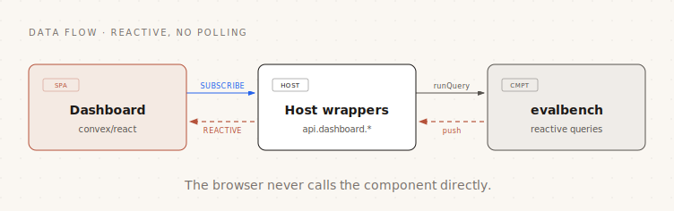

# Dashboard

A companion React single-page app that renders the four evalbench areas
live: **Traces**, **Runs**, **Datasets**, and **Compare**. It reads every
value through `convex/react` `useQuery` subscriptions, so span trees and
run summaries fill in without polling. It ships in-repo at `dashboard/` as
a reusable reference app: point it at any Convex deployment that exposes
the host-wrapper contract below.



The browser never calls the component directly (Convex does not expose a
component's functions to a client, and `ctx.auth` does not propagate into
component code). It talks only to the host wrappers, which are the place
you add any auth gate.

## Running it

The dashboard reads its target deployment from `VITE_CONVEX_URL`.

```bash
# 1. Start the example backend (writes VITE_CONVEX_URL into .env.local).
pnpm local:start           # in one terminal, leave running
npx convex dev --once      # deploy the example functions (incl. dashboard.ts)

# 2. Start the dashboard dev server (Vite, HMR).
pnpm dev:dashboard         # http://localhost:5180
```

`envDir` is the repo root, so the dashboard reuses the same `.env.local`
that the backend tooling writes. To target a different deployment, copy
`dashboard/.env.example` and set `VITE_CONVEX_URL`.

Build and gate:

```bash
pnpm build:dashboard       # tsc --noEmit && vite build
pnpm check                 # the repo gate; runs the dashboard's tsc + tests + lint too
```

## The host-wrapper contract

The dashboard depends only on a documented set of host functions, all
implemented in one self-contained module, [`example/convex/dashboard.ts`](../example/convex/dashboard.ts).
To run the dashboard against your own deployment, copy that file into your
`convex/`, add any auth gate you need, and keep the function names stable.

| Function | Kind | Args | Returns |
| --- | --- | --- | --- |
| `listRecentTraces` | query | `{ limit? }` | root spans, newest first |
| `spansByTrace` | query | `{ traceId }` | all spans of a trace (metadata only) |
| `spanContent` | query | `{ spanId }` | inline `input`/`output` + signed URLs, on demand |
| `listDatasets` | query | `{ includeArchived? }` | dataset versions |
| `listItems` | query | `{ datasetId }` | items of a dataset |
| `createDataset` | mutation | `{ name, description?, items? }` | new dataset id |
| `versionDataset` | mutation | `{ datasetId }` | new version's id |
| `archiveDataset` | mutation | `{ datasetId }` | `null` |
| `listAllRuns` | query | `{ limit? }` | runs across all datasets, newest first |
| `listRuns` | query | `{ datasetId, limit? }` | runs of one dataset (compare pickers) |
| `runSummary` | query | `{ runId }` | the run row with live counters |
| `listResults` | query | `{ runId }` | one result row per item |
| `redriveRun` | mutation | `{ runId, olderThanMs? }` | `{ repended, erroredOut }` |
| `compareRuns` | query | `{ baselineRunId, candidateRunId }` | per-item comparison + stats |
| `evaluateGate` | query | `{ baselineRunId, candidateRunId, thresholds? }` | `{ ok, reasons, stats }` |

Each wrapper is a two-line delegation to the corresponding `Evalbench`
client method; see [docs/tracing.md](./tracing.md) and
[docs/evals.md](./evals.md) for the underlying shapes. `listAllRuns`
composes `listDatasets` + per-dataset `listRuns` in a single reactive
query, since the component has no cross-dataset run index.

## The four views

- **Traces**: recent traces newest first with a status/text filter; a
  trace opens to a live-filling span tree assembled from `parentSpanId`.
  Each span shows status, tokens, cost, and a duration bar (from
  `latencyMs`, or `endedAt - startedAt` when latency is unrecorded), with
  tokens and cost rolled up onto parents. Span content is resolved only on
  demand (inline text shown directly, a link for File-Storage content).
- **Runs**: every run across datasets, linking to a run detail with a
  live summary (completed / passed / aggregate score) and a per-item
  results table. Each row joins the dataset item by `itemId` to show
  input, expected output, and produced output, plus one column per scorer,
  the aggregate item score, status, and a trace link. A **Redrive** action
  appears for a run still `running`.
- **Datasets**: dataset versions (archived hidden behind a toggle) with
  an items table; **New dataset** (create dialog), **New version**, and a
  type-to-confirm **Archive**.
- **Compare**: pick a dataset, a baseline run, and a candidate run (all
  encoded in the URL, so a comparison is shareable). Shows the gate
  verdict, the aggregate score movement (classification counts + mean
  score change), and a per-item table with each item's classification and
  score delta. Expanding an item diffs the candidate output against the
  baseline output side by side.

## Design system and conventions

The UI kit (`dashboard/src/ui/`) is built once and composed by every view;
no primitive is reimplemented per view. It ports the editorial design
tokens from the sibling `convex-orchestrator` app (warm-paper palette, ink
primary, one rust accent, desaturated status hues).

- **Buttons** express intent: `primary` for the main action, `secondary`
  for cancel/non-primary, `accent` for the creation CTA, `destructive`
  (and `destructiveSolid`) for delete/discard.
- **Dialogs** are accessible: focus moves in on open and is restored on
  close, Escape closes, Tab is trapped, and the panel is `aria-modal`.
  `ConfirmDialog` gates a destructive action behind typing the target's
  name.
- **DataState** renders the uniform loading / empty / error / success
  states from a `useQuery` result, so no view hand-rolls those.
- **Filtering** is client-side over the loaded window (the queries cap and
  order); a server-side query language and saved views are out of scope.

## Testing

Vitest + React Testing Library (jsdom) cover the UI kit (button
variant-to-class, dialog focus/Escape/trap, confirm gating, DataState
branches) and the pure view derivations (span-tree rollup and duration
scaling, run-result joins and scorer columns, compare movement and output
diff, the list filter). End-to-end visual checks are done with
`playwright-cli` against the dev server. All of it joins `pnpm check`.
